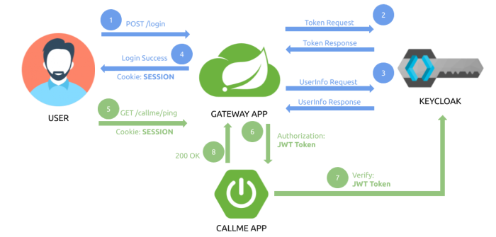

# FlexiDorms

## Microservices:
1. **Config service:** 
This service is responsible for providing the configuration to other services. It is a centralized configuration service.
    - URL: `http://localhost:8888/`

2. **Registry service:** 
This service is responsible for service discovery and registration of services. It is a Eureka server.
    - URL: `http://localhost:8761/`

3. **Gateway service:**
This service is responsible for routing the requests to the appropriate service.
    - URL: `http://localhost:8080/`

4. **User service:**
This service is responsible for user management. Also, it provides the APIs for user registration, login, logout, etc.
    - URL: `http://localhost:8090/`

## Order to start the services:
1. Config service
2. Registry service
3. Admin service
4. Gateway service
5. the other services...

## Util commands:
- **Search with process use a specific port:** 
    - Windows: `netstat -aon | findstr [port]`
- **Kill a process by PID:**
    - Windows: `taskkill /F /PID [pid]`

## Config Keycloak:
***NOTE:*** The Keycloak server is used to provide the authentication and authorization services (Authorization Server)
1. **Start Keycloak server:** With docker-compose or `docker run -p 9090:8080 -e KEYCLOAK_ADMIN=<username> -e KEYCLOAK_ADMIN_PASSWORD=<password> quay.io/keycloak/keycloak:24.0.4 start-dev`
2. **Create a realm (tenant):** Use the app name
3. **Create a client:** 
    - In the input "Client ID" set: <app-name>-client
    - Enable the "Client authentication" option that is AccessType=confidential
    - In "Valid redirect URIs" input set `http://localhost:<gateway-port>/login/oauth2/code/<client-id>`, that is the URL where the client is going to be redirected after a successful login
    - In "Web Origins" input set: `*`
4. Create a user

## Config Keycloak in the services:
***NOTE:*** The services are going to be the Resource Server, that is the service that is going to validate the JWT token.
1. **Add the dependencies:** 
    ```xml
   <dependencies>
       ...
       <!--START KEYCLOAK DEPENDENCIES-->
       <dependency>
           <groupId>org.springframework.boot</groupId>
           <artifactId>spring-boot-starter-oauth2-resource-server</artifactId>
       </dependency>
       <dependency>
           <groupId>org.springframework.boot</groupId>
           <artifactId>spring-boot-starter-security</artifactId>
       </dependency>
       <dependency>
           <groupId>org.springframework.security</groupId>
           <artifactId>spring-security-oauth2-jose</artifactId>
       </dependency>
       <!--END KEYCLOAK DEPENDENCIES-->
       ...
   </dependencies>
    ```
2. **Add the Keycloak configuration in the `application.yml` file:**
   * The issuer-uri can be found in the Keycloak server in: `Realm Settings/Endpoints/OpenID Endpoint Configuration` 
    ```yaml
    spring:
      security:
        oauth2:
          resourceserver:
            jwt:
              issuer-uri: http://localhost:9090/realms/<realm-name>
    ```
## Authentication flow diagram:
